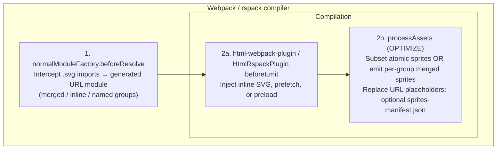
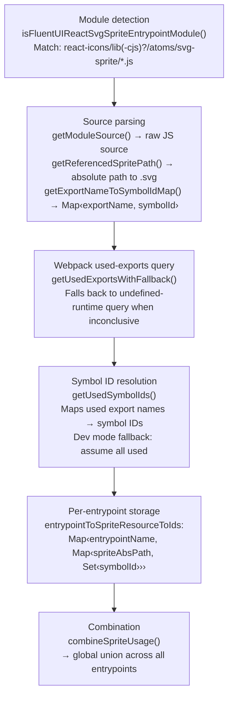
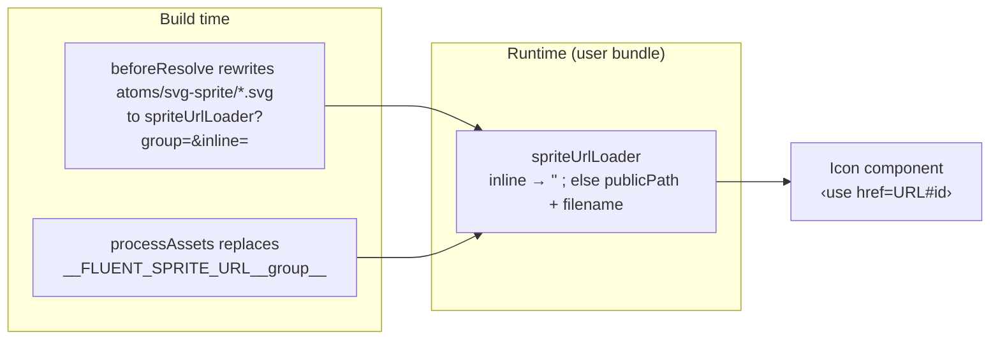
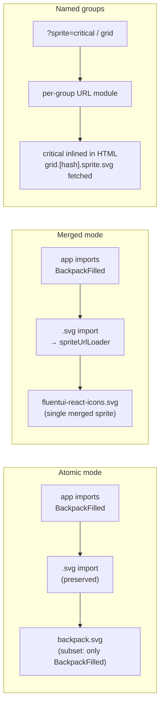

# Plugin Specification

> Internal documentation for contributors. For usage see [README.md](./README.md).

## Overview

The plugin optimises `@fluentui/react-icons/svg-sprite/*` entrypoints at build time by analysing which icon exports are actually used and stripping unused `<symbol>` elements from sprite SVGs.

It hooks into Webpack's module resolution, runtime injection, HTML template processing, and asset optimisation stages to achieve this across three operating modes: **atomic**, **merged**, and **inline**.

## Architecture



## Hook Lifecycle

### 1. `normalModuleFactory.beforeResolve`

**Condition:** `mode === 'merged'` OR `injectSpritesInTemplates.mode === 'inline'` OR named groups (`sprites` / `?sprite=`).

NormalModuleFactory `beforeResolve` intercepts `.svg` imports from `atoms/svg-sprite/` and rewrites them to a **generated URL module** (`runtime/spriteUrlLoader` + `runtime/empty`). The loader exports `__webpack_public_path__ + "<placeholder>"` (or `""` when the group is inlined). After the sprite asset is emitted, the plugin replaces the placeholder with the final filename. There is no webpack `RuntimeModule`, so the same path runs on rspack.

| Scenario          | Replacement module        | Exported value                         |
| ----------------- | ------------------------- | -------------------------------------- |
| Inline group      | `runtime/spriteUrlLoader` | `''` (empty — symbols are in the DOM)  |
| Merged / deferred | `runtime/spriteUrlLoader` | Public URL of the (group) sprite asset |

In **atomic** mode without groups this hook does not rewrite — original `.svg` imports are preserved and each sprite is emitted as a separate asset.

### 2a. HTML plugin `beforeEmit`

**Condition:** `injectSpritesInTemplates !== false` AND `html-webpack-plugin` / `HtmlRspackPlugin` is installed.

| `mode`       | Behaviour                                                                                                                                                 |
| ------------ | --------------------------------------------------------------------------------------------------------------------------------------------------------- |
| `inline`     | Builds a merged sprite from symbols used by the HTML page's entrypoints, strips the XML declaration, and injects it after the opening `<body>` tag.       |
| `reference`  | Collects the public URLs of used sprite assets (atomic or merged) and injects `<link rel="preload" as="image" type="image/svg+xml">` tags after `<head>`. |
| named groups | Inlined groups go into `<body>`; deferred groups may get `<link rel="prefetch">`.                                                                         |

### 2b. `compilation.processAssets` (OPTIMIZE stage)

Performs the actual asset transformation:

- **Atomic mode:** Iterates each sprite SVG asset and removes `<symbol>` elements whose IDs are not in the used set (`subsetAtomicSprites`).
- **Merged mode:** Emits (or updates) a single merged sprite asset containing only used symbols from all sprite sources (`buildMergedSprite`).
- **Manifest:** When `generateSpritesManifest` is enabled, emits `sprites-manifest.json` with per-entrypoint usage data.

## Used-Exports Analysis

The core analysis runs during `processAssets` (lazily initialised and cached). It follows this chain:



### Entrypoint association

Each detected sprite module is associated with entrypoints via `chunkGraph.getModuleChunksIterable()`. If a module has no chunk assignment (edge case), it is conservatively attributed to **all** entrypoints.

### Fallback behaviour

When `optimization.usedExports` is disabled (common in development), `getUsedExports` returns `null` or a boolean. The plugin treats this as "all exports used" and keeps every symbol — no subsetting occurs but the build remains correct.

The `forceEnableUsedExports` option (default: `true`) mitigates this by setting `optimization.usedExports = true` when unset.

## Runtime URL modules

Two files in `src/runtime/` replace webpack `RuntimeModule` so the same path runs on rspack:



### `spriteUrlLoader.ts`

Query: `?group=grid&inline=1`. Inlined groups export an empty string (`<use href="#id">`). Other groups export `__webpack_public_path__ + "__FLUENT_SPRITE_URL__<group>__"`, and the plugin substitutes the emitted filename after hashing.

### `empty.ts`

Dummy resource so the loader has something to attach to. The URL is an emitted asset reference, not a runtime global.

### Named groups

`?sprite=` on the atom module (from the loader's `variantRules` or an import query) selects a group. The plugin stamps that group onto the child `.svg` import so each group gets its own URL module instance. Inlined groups are written into HTML; deferred groups emit `[name].[contenthash].sprite.svg` and may get `<link rel="prefetch">`.

Which groups get a merged sprite is read back from the module graph at asset time (the URL modules that exist, keyed by their `group` query) rather than from the resolve hook, so a watch rebuild that serves unchanged modules from cache still emits them. Groups without a URL module — the ungrouped imports of a build that mixes both — keep their own `.svg` assets and go through atomic subsetting instead.

Because a group resolves to exactly one URL for all of its atoms, a symbol used from two groups is emitted in both. There is no "hoist into the inlined group" policy: the atoms of a deferred group cannot address the inlined document, so dropping the symbol from their sprite would leave them pointing at nothing.

## Options Validation

Options are validated in two layers:

1. **Schema validation** (`options.schema.json`): JSON Schema enforced via `schema-utils` at construction time. Rejects unknown properties and validates types/enums.
2. **Semantic validation** (`normalizeOptions`):
   - `mergedSpriteFilename` is rejected when `mode !== 'merged'`.
   - Filename placeholders are restricted to `[fullhash]` and `[contenthash]`.
   - `injectSpritesInTemplates: true` normalises to `{ mode: 'inline' }`.

## Mode Comparison



| Aspect                   | Atomic                 | Merged                    | Named groups                     |
| ------------------------ | ---------------------- | ------------------------- | -------------------------------- |
| SVG imports rewritten?   | No                     | Yes → `spriteUrlLoader`   | Yes, one URL module per group    |
| Runtime module injected? | No                     | No                        | No                               |
| Output assets            | N subset sprite SVGs   | 1 merged sprite SVG       | 1 sprite per non-inlined group   |
| HTML injection           | Optional preload links | Optional preload / inline | Inline and/or prefetch per group |
| Requires HTML plugin?    | Only for preload       | Only for preload / inline | For inlined / prefetched groups  |

## Test Infrastructure

Tests live in `test/` and are driven by Webpack and rspack builds with a validation plugin:

```
test/
├── webpack.config.js         # Configurable via env vars
├── rspack.config.js
├── run.js                    # webpack + rspack scenarios
├── types.conformance.ts      # bundler interface drift protection
├── validation.js             # Constructor validation tests
├── src/
│   ├── atomic.js             # Entry: imports BackpackFilled, CalculatorFilled
│   ├── merged.js             # Entry: same imports
│   ├── groups.js             # ?sprite=critical and ?sprite=grid
│   └── groups-mixed.js       # ?sprite=critical next to an ungrouped import
└── __mock__/
    └── react-icons/lib/atoms/svg-sprite/
        ├── backpack.js       # 18 exports (various sizes/styles)
        ├── backpack.svg      # 18 <symbol> elements
        ├── calculator.js     # 6 exports
        └── calculator.svg    # 6 <symbol> elements
```

### What is validated

- **Atomic mode:** Each sprite asset contains only used symbols (e.g. `BackpackFilled` present, `BackpackRegular` absent).
- **Merged mode:** A single merged sprite contains only used symbols; no individual sprite assets are emitted.
- **Inline injection:** HTML contains the inline `<svg>` with used symbol IDs.
- **Reference injection:** HTML contains `<link rel="preload">` tags pointing to sprite assets.
- **Manifest:** `sprites-manifest.json` is emitted with correct entrypoint/symbol structure.
- **Named groups:** Critical sprite inlined in HTML; deferred `grid.[hash].sprite.svg` emitted with prefetch; bundle references the grid filename.
- **Mixed groups:** With one `?sprite=` import and no `sprites` option, the grouped atom gets its own sprite while the ungrouped one is still subset in place and no unreferenced merged sprite is emitted.
- **Constructor:** Rejects invalid option combinations (e.g. `mergedSpriteFilename` in atomic mode, unsupported placeholders, unusable group names).
- **Types:** `test/types.conformance.ts` fails to compile if webpack or rspack drifts out of the bounds described in `src/bundler-api.ts`.

### Running tests

```sh
# Full test suite (all modes)
yarn nx run react-icons-svg-sprite-subsetting-webpack-plugin:test

# Individual test scripts
yarn test:atomic      # atomic mode build + validation
yarn test:merged      # merged mode build + validation
yarn test:inline      # inline injection build + validation
yarn test:reference   # reference injection build + validation
yarn test:groups      # named sprite groups (critical inline + deferred grid)
yarn test:types       # bundler type conformance
yarn test:validation  # constructor validation
```
